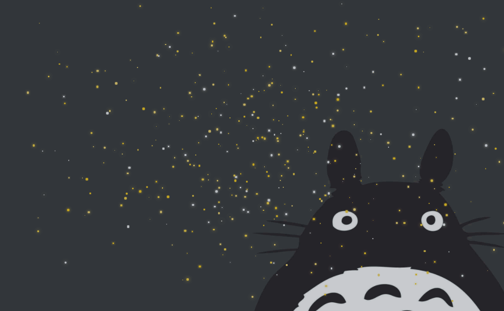
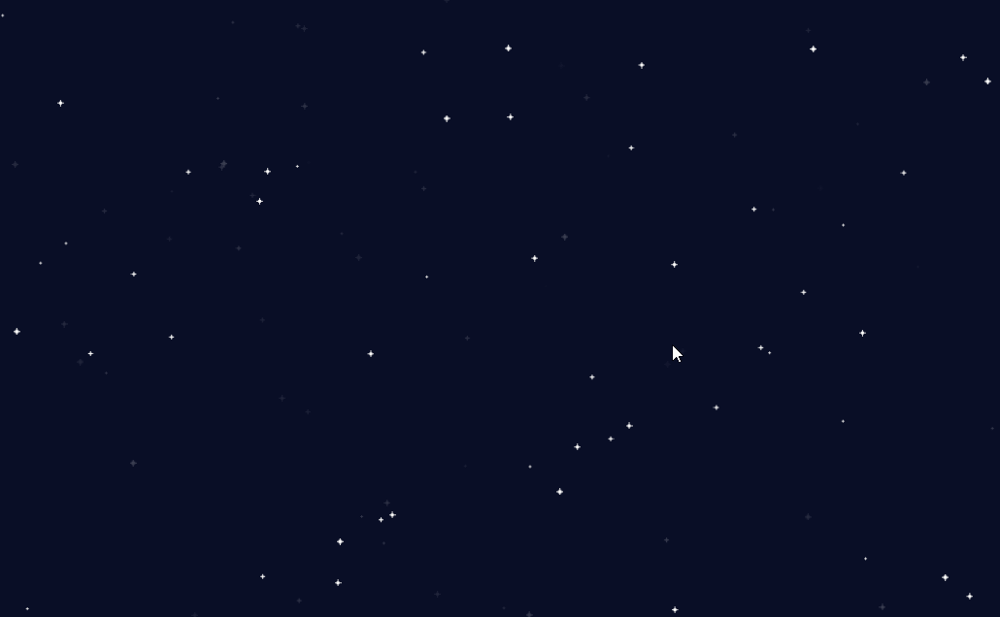

# jQuery夜晚天空满天星星闪烁动画代码

## 萤火虫星空效果图

<a href="img/Totoro.gif"></a> 

[在线查看](http://en.jsrun.net/7GYKp)

[在线编辑](http://en.jsrun.net/7GYKp/edit)

## 背景星星效果图

<a href="img/blick.gif"></a> 

[在线查看](http://en.jsrun.net/D2qKp)

[在线编辑](http://en.jsrun.net/D2qKp/edit)

###  萤火虫星空CSS样式
```
<style>
* {
  box-sizing: border-box;
  padding: 0;
  margin: 0;
}

body {
  background: #22313f;
}

#starsBox {
  position: fixed;
  top: 0;
  left: 0;
  right: 0;
  bottom: 0;
  background: rgba(0, 0, 0, 0.75);
  opacity: .85;
}
#starsBox span {
  display: inline-block;
  width: auto;
  position: absolute;
  border-radius: 100%;
  transition: 100s linear;
}

p {
  position: fixed;
  top: 50%;
  left: 0;
  right: 0;
  text-align: center;
  transform: translateY(-50%);
  font-size: 40px;
  font-weight: 900;
  color: white;
  text-shadow: 0 0 50px black;
  text-transform: uppercase;
  font-family: 'Roboto','Helvetica','Arial',sans-serif;
  letter-spacing: 5px;
}
p > span {
  display: block;
  font-size: 12px;
  color: #bdc3c7;
  margin-top: 30px;
  font-weight: 100;
  text-shadow: 0 0 50px black;
  letter-spacing: 3px;
}
p > span > a {
  font-weight: 700;
  text-decoration: none;
  color: #d64541;
  padding-bottom: 2px;
  border-bottom: 0px solid #d64541;
  transition: 0.5s;
}
p > span > a:hover {
  padding-bottom: 5px;
  border-bottom: 2px solid #d64541;
}
</style>
```
### 萤火虫星空JavaScript动画代码
```
var cols = ['#f5d76e','#f7ca18','#f4d03f','#ececec','#ecf0f1','#a2ded0'];
var stars = 500;

for (var i = 0; i <= stars; i++) {

	var size = Math.random()*5;
  var color = cols[parseInt(Math.random()*4)];

	$('#starsBox').prepend('<span style=" width: ' + size + 'px; height: ' + size + 'px; top: ' + Math.random()*100 + '%; left: ' + Math.random()*100 + '%; background: ' + color + '; box-shadow: 0 0 '+ Math.random()*10 +'px' + color + ';"></span>') ;
};

setTimeout(function(){ 
	$('#starsBox span').each(function(){  
 		$(this).css('top', Math.random()*100 + '%').css('left', Math.random()*100 + '%'); 
  });
}, 1);

setInterval(function(){ 
	$('#starsBox span').each(function(){  	
 		$(this).css('top', Math.random()*100 + '%').css('left', Math.random()*100 + '%'); 
  });
}, 100000);
```

### 背景星星JavaScript代码

源码是经过babel 编译的

如果你的浏览器不支持的话

[bable在线编译](http://babeljs.io/repl/)
```
(function () {
  const star_png = 'http://flowpp.com:8080/img/star.png'
  const ICON_SIZE = 7
  const ICON_NUM = 7
  const star_num = 300

  class Start {
      constructor (star, rect) {
          this.star = star
          this.init(rect)
      }
      init (rect) {
          this.rect = rect || this.rect
          this.index = Math.random() * ICON_NUM | 0
          this.x = Math.random() * this.rect.width
          this.xSpd = Math.random() * 0.04 - 0.02
          this.y = Math.random() * this.rect.height
          this.alpha = Math.sin(Math.random() * Math.PI * 2)
          this.timer = 0
      }
      draw (ctx) {
          ctx.save()
          ctx.globalAlpha = this.alpha * 0.2
          ctx.drawImage(this.star, this.index * ICON_NUM, 0, ICON_SIZE, ICON_SIZE, this.x, this.y, ICON_SIZE, ICON_SIZE)
          ctx.restore()
      }
      update () {
          this.x += this.xSpd
          if (this.x > this.rect.width || this.x < 0) {
              this.init()
          }

          this.timer += 1
          if (this.timer > 8) {
              this.index = (this.index + 1) % ICON_NUM
              this.timer = 0
          }
      }
  }
  
  class StarrySky {
      constructor (props) {
          let dom = props.dom
          let t = this
          t.dom = dom
          t.context = dom.getContext('2d')
          t.star = new Image()
          t.now = Date.now()

          let stars = []
          t.stars = stars

          let loop = t.loop
          t.star.onload = function () {
              t.rect = dom.getBoundingClientRect()
              t.dom.width = t.rect.width
              t.dom.height = t.rect.height

              for (let i = 0; i < star_num; i++) {
                  stars[i] = new Start(t.star, t.rect)
              }

              setInterval(loop, 40)

              window.addEventListener('resize', function () {
                  t.rect = dom.getBoundingClientRect()
                  t.dom.width = t.rect.width
                  t.dom.height = t.rect.height
                  stars.map(s => {
                      s.init(t.rect)
                  })
              })
          }
          this.star.src = star_png
      }
      loop = () => {
          this.context.fillStyle = 'rgb(10, 15, 39)'
          let {width, height} = this.rect
          this.context.fillRect(0, 0, width, height)
          for (let i = 0; i < star_num; i++) {
              this.stars[i].update()
              this.stars[i].draw(this.context)
          }
      }
  }
  
 	const canvas = document.createElement('canvas')
  canvas.width = document.documentElement.clientWidth
  canvas.height = document.documentElement.clientHeight
  document.body.insertBefore(canvas, document.body.children[0])
  canvas.className = 'starry-sky'
  let starrySky = new StarrySky({
      dom: canvas
  })
  
})()
```
Copyright 2017 appzy
